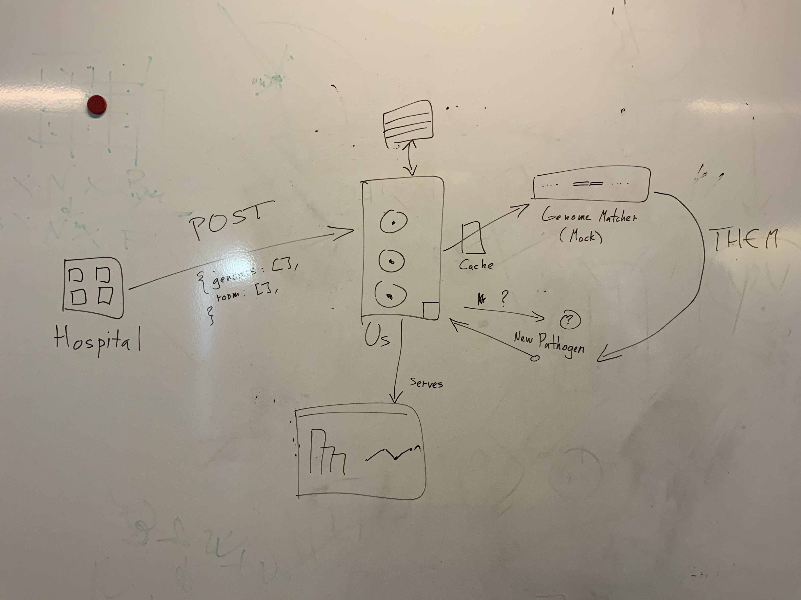

# Visualization

# First Steps
These are the first things we need to accomplish.

After we've done everything on this list, we'll be able to work independently on new features over the course of things

- Mock Service for genome matching

At first, this service can just give a True/False answer, later we'll expand this to a hierarchy of genomes.

This is a good occasion to learn how to make basic webservices using Python and Flask.

- Hospital API

This is the API that accepts new submissions from a given hospital.

- New pathogen API

This accepts new pathogens for our knowledge.

- Websocket API

This gives real time feedback to the frontend about alerts and whatnot.

- Frontend

This will need to use a javascript UI of some kind (Vue). This will present information about the pathogens present and their spread across the Hospital.

-IP 
Mock sophia 6000
WS 1234
HopitalAPI 5000
